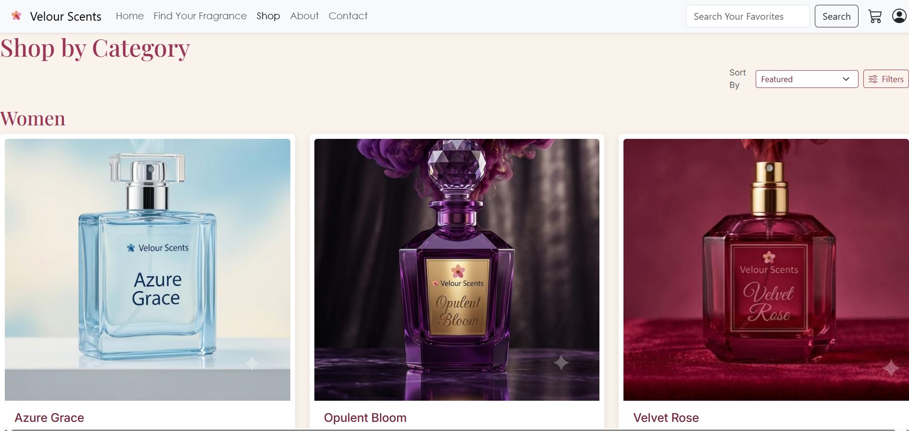
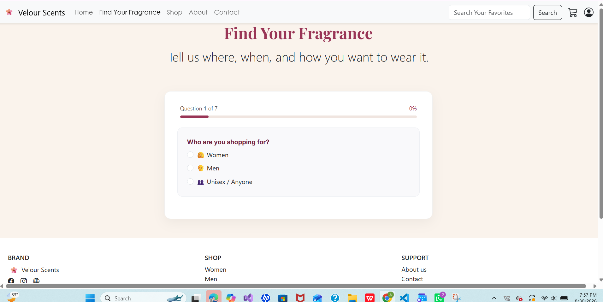
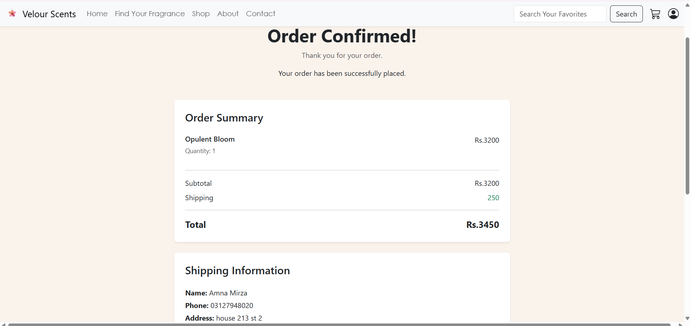

# 🌸 Velour Scents — Pakistani Perfume E-Commerce Platform

> *Soft florals, quietly worn.*

A full-stack e-commerce web application for a Pakistani perfume brand, built as a practice project to apply skills across the complete web development stack. Velour Scents offers a real-world shopping experience with product discovery, cart management, checkout, order tracking, and a fragrance recommendation quiz.

---

## 🚀 Live Demo

> Coming soon after deployment

---

## ✨ Features

### 🛍️ Shopping Experience
- **Product Catalog** — 15 curated fragrances across Women, Men, and New Arrivals categories
- **Product Detail Pages** — Dynamic pages with full product info, size, quantity selector, and related products
- **Search** — Real-time product search by name
- **Filters & Sort** — Slide-out filter drawer with price range slider and scent profile filtering; sort by price and alphabetically
- **Category Navigation** — Anchor-linked category sections with smooth scrolling

### 🧪 ScentIQ Quiz — *Find Your Fragrance*
- 7-question multi-step fragrance recommendation quiz
- One question at a time with animated progress bar
- Weighted scoring algorithm across 7 product attributes (gender, occasion, weather, scent profile, projection, longevity, adventurousness)
- Top 3 matches displayed with percentage accuracy and personalized "Why this works for you" explanations
- Culturally adapted for Pakistani context (Eid, wedding, university occasions)

### 🛒 Cart & Checkout
- Session-based guest cart (no login required)
- Add to cart with quantity selector
- Remove items by index (handles duplicate products correctly)
- Live cart count badge on navbar
- "Added to cart" confirmation alert
- Full checkout flow with Pakistani city selection and phone number validation
- Multiple payment methods: Cash on Delivery, JazzCash, Easypaisa, Bank Transfer
- Dedicated payment pages for each online method
- Order confirmation page with full summary and shipping details

### 👤 Authentication
- User registration with bcrypt password hashing
- Login with secure session management
- Logout with session destruction
- Guest checkout (auth optional — never blocks purchasing)
- Navbar dynamically switches between login modal and user dropdown
- My Orders page — view full order history linked to user account

### 📦 Orders
- Orders saved to MongoDB with full item details, subtotal, and shipping info
- Linked to user accounts via user ID
- My Orders page with order cards showing items, totals, and order ID

### 📄 Informational Pages
- About Us — brand story with background image and values section
- Contact Us — functional contact form with server-side validation
- FAQs — Bootstrap accordion with Pakistan-specific answers (COD, delivery times, halal considerations)
- Shipping & Returns — Pakistani pricing (Rs.), city-specific delivery times, return policy

---

## 🧰 Tech Stack

| Layer | Technology |
|---|---|
| Frontend | HTML5, CSS3, Bootstrap 5, Bootstrap Icons, EJS templating |
| Backend | Node.js, Express.js |
| Database | MongoDB Atlas, Mongoose ODM |
| Authentication | bcrypt, express-session |
| Architecture | MVC-inspired (Models, Routes, Views, Utils) |

---

## 📁 Project Structure

```
velour-scents/
├── config/
│   └── db.js                  # MongoDB Atlas connection
├── models/
│   ├── Product.js             # Product schema with quiz attributes
│   ├── Order.js               # Order schema with shipping + items
│   └── user.js                # User schema with bcrypt
├── routes/
│   ├── productRoutes.js       # Homepage, shop, product detail, search
│   ├── authRoutes.js          # Register, login, logout
│   ├── cartRoutes.js          # Add, view, remove cart items
│   ├── orderRoutes.js         # Checkout, payment, order confirmation, my orders
│   ├── quizRoutes.js          # ScentIQ quiz GET + POST
│   └── pageRoutes.js          # About, contact, FAQ, shipping-returns
├── utils/ 
│   └── quizHelper.js          # scoreProduct() scoring algorithm
├── views/
│   ├── partials/
│   │   ├── header.ejs         # Shared navbar + modals
│   │   └── footer.ejs         # Shared footer + scripts
│   ├── index.ejs
│   ├── shop.ejs
│   ├── product-detail.ejs
│   ├── cart.ejs
│   ├── checkout.ejs
│   ├── orderconfirmation.ejs
│   ├── orders.ejs
│   ├── quiz.ejs
│   ├── result.ejs
│   ├── search.ejs
│   ├── contact.ejs
│   ├── aboutus.ejs
│   ├── faq.ejs
│   ├── shipping-returns.ejs
│   └── payment-*.ejs          JazzCash, Easypaisa, Bank Transfer
├── public/
│   ├── css/style.css
│   ├── js/
│   └── images/
├── seed.js                    # Database seeding script
├── server.js                  # App entry point
└── package.json
```

---

## 🗃️ Database Schema

### Product
```javascript
{
  name, price, description, image,
  category: [String],        // ['women'], ['men'], ['new-arrivals']
  gender: [String],          // ['women'], ['men'], ['unisex']
  occasion: [String],        // ['university', 'office', 'wedding', 'eid', 'family', 'casual']
  weather: [String],         // ['hot', 'mild', 'cold']
  scentProfile: String,      // 'fresh' | 'floral' | 'woody' | 'spicy' | 'sweet'
  projection: String,        // 'subtle' | 'moderate' | 'strong'
  longevity: String,         // '4-6' | '6-8' | '8+'
  adventurousness: String    // 'safe' | 'different' | 'distinctive'
}
```

### Order
```javascript
{
  userid, items: [Object],
  subtotal, shipping: { firstname, lastname, address, phonenumber, city, code, paymentMethod },
  status: 'pending',
  timestamps: true
}
```

### User
```javascript
{
  name, email (unique), password (bcrypt hashed),
  timestamps: true
}
```

---

## ⚙️ Getting Started

### Prerequisites
- Node.js v18+
- MongoDB Atlas account (free tier)

### Installation

```bash
# Clone the repository
git clone https://github.com/yourusername/velour-scents.git
cd velour-scents

# Install dependencies
npm install

# Create a .env file in the project root
MONGO_URI=your_mongodb_atlas_connection_string
SESSION_SECRET=your_secret_key

# Seed the database with 15 products
node seed.js

# Start the server
node server.js
```

Visit `http://localhost:3000`

---

## 🌱 Seeding the Database

The `seed.js` script inserts all 15 perfume products with complete quiz attributes into MongoDB:

```bash
node seed.js
```

This will:
1. Clear any existing products
2. Insert all 15 products with quiz matching attributes
3. Close the connection automatically

---

## 🧠 ScentIQ Scoring Algorithm

Each product is scored against the user's 7 quiz answers using weighted criteria:

| Criteria | Weight |
|---|---|
| Scent Profile | 25% |
| Occasion | 20% |
| Gender | 5% |
| Weather | 10% |
| Projection | 15% |
| Longevity | 15% |
| Adventurousness | 10% |

Top 3 scoring products are returned with match percentage and natural language explanations.

---

## 🇵🇰 Pakistani Localization

- Prices in PKR (Rs.)
- Pakistani cities in checkout (Lahore, Karachi, Islamabad, Rawalpindi, Multan, Faisalabad, Quetta)
- Pakistani phone number validation (`03XX-XXXXXXX` format)
- Payment methods: COD, JazzCash, Easypaisa, Bank Transfer
- Free shipping threshold: Rs. 5,000
- Culturally appropriate quiz occasions (Eid, Nikah/Wedding, Family Gathering, University)
- FAQ content tailored for Pakistani customers

---

## 📸 Screenshots






---

## 🔮 Future Improvements


- [ ] AI chatbot assistant using Gemini API
- [ ] Product reviews and ratings
- [ ] Admin dashboard for product management
- [ ] Email order confirmation using Nodemailer
- [ ] Wishlist functionality
- [ ] Discount codes and promotions

---

## 👩‍💻 Developer

**Amna Mirza** — Software Engineering Student, Pakistan

Built as a full-stack practice project covering HTML, CSS, JavaScript, Node.js, Express.js, EJS, MongoDB, and Mongoose.

---

## 📄 License

This project is for educational purposes. Product images and brand name are fictional and created for practice only.

---

*Made with ❤️ and a lot of `console.log()` debugging*
